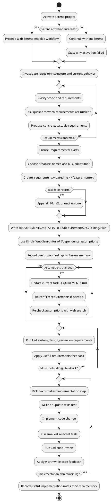

## Working Agreement

This skill is intentionally **always-on** for coding tasks. Follow it exactly unless the user explicitly opts out.

### Non-negotiables

1. **Serena first**: Start by activating the Serena project (if the Serena tools exist in the environment). If activation fails for reasons outside your control, continue without Serena and say why.
2. **Investigate before changing anything**: Understand the current state (application state, execution results, user input, logs) before proposing edits.
3. **No requirement changes without confirmation**: If requirements are unclear, ask clarifying questions. Before you change/add/interpret requirements, get explicit confirmation.
4. **Create a per-task `REQUIREMENTS.md` before implementation**:
   - Create/use root `.requirements/`.
   - For each task, choose a short snake_case feature name using lowercase ASCII letters, digits, and underscores only (for example, `update_github_authentication`).
   - Create a folder named `<datetime>_<feature_name>` using UTC datetime format `YYYYMMDDTHHMMSSZ` (for example, `20260301T143210Z_update_github_authentication`).
   - If the folder already exists, append a numeric suffix (`_01`, `_02`, and so on) to avoid collisions. Example: `.requirements/20260301T143210Z_update_github_authentication_01/`.
   - Write the task requirements file to `.requirements/<datetime>_<feature_name>/REQUIREMENTS.md` using the mandated structure (below).
5. **Use up-to-date docs**: When you rely on an API/package/technology detail, use Kindly Web Search (if available) to confirm signatures, version behavior, breaking changes, and deprecations.
6. **Smallest possible steps (TDD)**: Implement one small change at a time and test each change (unit → integration → smoke as appropriate) before proceeding.

## Per-task `REQUIREMENTS.md` Structure (Mandated)

For each task, write `REQUIREMENTS.md` to `.requirements/<datetime>_<feature_name>/REQUIREMENTS.md` with:

1. **As Is**: current behavior/state (what exists today).
2. **To Be**: desired behavior/state after the change.
3. **Requirements**: functional requirements (numbered).
4. **Acceptance Criteria**: for every functional requirement, add explicit acceptance criteria.
5. **Testing Plan**: test strategy + cases (TDD best practices).
6. **Implementation Plan**: the smallest sequential code changes; for each change, include how you’ll test it.

## Workflow (Step-by-step)

### 1) Investigate

- Inspect the repository structure, relevant code paths, current behavior, and existing tests.
- Run the smallest commands needed to confirm the current state (build/test, smoke, reproducer), when applicable.
- Summarize findings briefly.

### 2) Clarify + confirm requirements

- Ask clarifying questions where anything is ambiguous (scope, UX, edge cases, compatibility, performance).
- Propose the requirements in concrete, testable language.
- Ask for explicit confirmation before finalizing requirements or changing them.

### 3) Create task requirements folder + `REQUIREMENTS.md`

- Ensure `.requirements/` exists at repository root.
- Choose a concise snake_case `<feature_name>` (lowercase ASCII letters, digits, and underscores only).
- Generate UTC `<datetime>` in format `YYYYMMDDTHHMMSSZ`.
- Create `.requirements/<datetime>_<feature_name>/`.
- If that folder already exists, append `_01`, `_02`, and so on, until you get a unique folder name.
- Write `.requirements/<datetime>_<feature_name>/REQUIREMENTS.md` before implementation.
- First, write the "As Is" section explaining the current state of the system. 
- Then, write the "To Be" section, describing in detail how the system should behave after the necessary changes. 
- Then write the "Requirements" section describing functional requirements.
- Use Kindly Web Search to get up-to-date documentation and information on packages, functions, APIs, and other technologies you plan to use.
- Record useful Kindly Web Search findings to Serena memories for future use.
- Then go over the "Requirements" section once again, and for every functional requirement, you add acceptance criteria.
- Then you add the "Testing Plan" section. You list there the testing plan for this new feature, following the test-driven development (TDD) best practices.
- Write the "Implementation Plan" section. Now, this is super important! In the "Implementation Plan", you always describe the smallest possible changes that need to be implemented one after the other to implement the requirements. For every change, you describe how to test it.

### 4) Validate assumptions

- Use Kindly Web Search to verify any API or dependency assumptions.
- Update the current task's `.requirements/<datetime>_<feature_name>/REQUIREMENTS.md` if assumptions change (and re-confirm requirements when needed).

### 5) Review with Lad MCP

- Review your system design in the current task's requirements file with `system_design_review` tool of the Lad MCP Server. Explain the requirements. Provide as much context as you can. 
- Review Lad's feedback and consider whether it is worth taking into account. Then, if necessary, update the current task's requirements file to incorporate this feedback.
- Keep reviewing the current task's requirements file with Lad until it stops providing useful feedback.

### 6) Implement with TDD and review with Lad

- Follow the Implementation Plan in order.
- Follow Test-Driven Development (TDD) best practices. Implement tests first. Implement feature next. Make sure the tests pass.
- After each step: run the smallest relevant tests first; expand to broader tests when confidence is needed.
- Keep diffs minimal and focused; avoid unrelated refactors.
- Use Lad MCP Server `code_review` tool to review each of your code changes. Implement the suggestions that are worthy of consideration.
- Keep reviewing your code with Lad until it stops providing useful feedback.
- Record useful implementation comments and design information to Serena memories for future use.

## Workflow Activity Diagram (PlantUML)

This diagram explains the same workflow as above in PlantUML format.

## Serena memories (when supported)

When Serena memory tools are available, store important information as short memories:

- `project_overview.md`: what the repo is, key architectural facts.
- `suggested_commands.md`: build/test/lint/smoke commands.
- `style_and_conventions.md`: coding conventions, patterns, gotchas.
- `bugs.md`: notable bugs + fixes (date, cause, prevention) when applicable.
